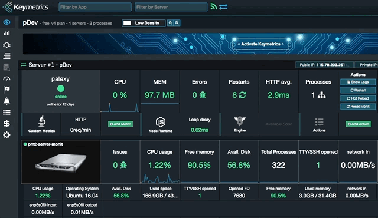

[](http://badge.fury.io/js/ng-file-upload)
# Vpop 
Multi-purpose, lightweight, easy to expand, shipped with lots of features Node.js server to bootstrap your project.

## Table of content
* [Features](#features)
* [Install](#install)
* [Configure and start your server](#configure)
* [Usage](#usage)

### Features <a name="features"></a> 
* [Take less than 60 seconds to add a new API](#60s)
* Built-in user role-based access control for API request
* Built-in user role-based access control for webpage request
* Shipped with basic user management: registration, email verification, ...
* Shipped with user registration via Facebook
* Shipped with mailing capability (send mail to user, system admin, ...)
* Shipped with file upload API
* Shipped with integrated Handlebars engine for HTML rendering
* Integrated socket.io real time engine (can turn on/off)
* Easy to scale with PM2 (for small to mid-level size project)

### Install <a name="install"></a> 
* Make sure you you Node.js installed before running the following commands
```javascript
git clone https://github.com/sonttran/server.git
cd server
npm install
```

### Configure and start your server<a name="configure"></a>
* All configurations are made in ONE file `config.json`
* This configuration is for <a href="http://pm2.keymetrics.io/docs/usage/application-declaration/" target="_blank">PM2</a> to daemonize your server process. It's highly recommended to get familiar with PM2 before continuing.
* Install <a href="https://www.mongodb.com/" target="_blank">MongoDB</a> and have your connection string ready
* Register Facebook app if you want to integrate Facebook login (optional)
* Install PM2 to your local and server machine
```
sudo npm install pm2 -g
pm2 install pm2-server-monit
```
* Have your email account for system mail (if not, user related API will result errors)
* Complete information in `config.json` file
```javascript
{
    apps : [
        {
            name                    : "server", // name of process in PM2 manager console
            script                  : "./server.js", // file to bootstrap
            exec_mode               : "cluster", // for scaling
            instances               : 1, // # of processes at start
            watch                   : ["core","server.js"], // files to watch for auto restart
            env_local               : { // your "local" environment in `pm2 start config.json --env local`
                "NODE_ENV"          : "local", // e.g. process.env.NODE_ENV = "local"
                "PORT"              : 3000, // server port
                "HOST"              : '0.0.0.0', // server host
                "DB_URL"            : 'mongodb://localhost:27017/app', // connection string to MongoDB
                "JWT_SECRET"        : 'Breaking Dawn', // json web token secret
                "SESSION_TIMER"     : "7 days", // time config for user session
                "FORGOT_PASS_TIMER" : "24h", // time config for password recovery token
                "FB_CLIENT_ID"      : "111100106689192", // Facebook ID for login with Facebook
                "FB_CLIENT_SEC"     : "111111111101330ab2e7672142d06040", // Facebook secret
                "FB_CALLBACK_URL"   : "http://localhost:3000/api/v1/loginWithFacebookCb", // callback
                "PUBLIC"            : "/Users/sontran/Doc/server/public/", // path to your public folder 
                "FILES"             : "/Users/son/Dropbox/FILES/resell", // path to store your server files
                "MAIL_NO_REPLY"     : {service: "gmail", // config server mail
                                       auth: {
                                           user: "example@gmail.com",
                                           pass: "password"
                                       }
                                      },
                "ERR_MAIL"          : {service: "gmail", // config system mail
                                       auth: {
                                           user: "example@gmail.com",
                                           pass: "password"
                                       }
                                      },
                "SERVER_ADMIN_EMAIL": 'admin_mail@example.com', // email to receive system alerts
                "SERVER_NAME"       : "Local Server", // name of your server in email
            },
            env_production          : { // your "production" environment in remote server with `pm2 start config.json --env production`
                "NODE_ENV"          : "production", 
                "PORT"              : 5600,
                "HOST"              : '127.0.0.1',
                "DB_URL"            : 'mongodb://localhost:27017/production',
                "JWT_SECRET"        : '111111',
                "SESSION_TIMER"     : "30 days",
                "FORGOT_PASS_TIMER" : "24h",
                "FB_CLIENT_ID"      : "12345678901234",
                "FB_CLIENT_SEC"     : "123456789023456789234567893456",
                "FB_CALLBACK_URL"   : "https://example.com/api/v1/loginWithFacebookCb",
                "PUBLIC"            : "/home/producttion/yourapp/current/public",
                "FILES"             : "/home/producttion/FILES/",
                "MAIL_NO_REPLY"     : {service: "gmail",
                                       auth: {
                                           user: "example@gmail.com",
                                           pass: "1234567890"
                                       }
                                      },
                "ERR_MAIL"          : {service: "gmail",
                                       auth: {
                                           user: "admin@example.com",
                                           pass: "1234567890"
                                       }
                                      },
                "SERVER_ADMIN_EMAIL": 'admin_email@example.com',
                "SERVER_NAME"       : "Production Server",
            },
        }
    ],
    "deploy"                        : { // for staging server deployment
        "staging"                   : { // "staging" in pm2 deploy config.json staging setup
            "user"                  : "username", // server user
            "host"                  : ["57.57.57.57"], // server IP
            "ref"                   : "origin/master",
            "repo"                  : "git@gitlab.com:yourcompany.com/yourapp.git", // git link
            "key"                   : "/path/to/key.pem", // path to server pem key in your local
            "path"                  : "/path/to/app", // path to app in your REMOTE server
            "ssh_options"           : "StrictHostKeyChecking=no",
            "pre-deploy-local"      : "echo 'This is a local executed command'",
            "post-deploy"           : "npm install && pm2 startOrRestart config.json --env staging",
            "env"  : {
                "NODE_ENV"          : "production",
            }
        },
        "production"                : { // for production server deployment
            "user"                  : "username",
            "host"                  : ["229.229.229.229"],
            "ref"                   : "origin/master",
            "repo"                  : "git@gitlab.com:yourcompany.com/yourapp.git",
            "key"                   : "/path/to/key.pem",
            "path"                  : "/path/to/app",
            "ssh_options"           : "StrictHostKeyChecking=no",
            "pre-deploy-local"      : "echo 'This is a local executed command'",
            "post-deploy"           : "npm install && pm2 startOrRestart config.json --env production",
            "env"  : {
                "NODE_ENV"          : "production",
            }
        },
    }
}
```
##### Start and tail your server locally after all configuration completed
```
pm2 start config.json --env local
pm2 logs server
```
##### Deploy your server in remote server
- Get your file folder and put it config file `"FILES" : "/home/producttion/FILES/"`
- Clone your repo to server
```
pm2 deploy config.json staging setup
```
- Get your app public folder and put it in config file `"PUBLIC" : "/home/producttion/yourapp/current/public"`
- Start your server remotely with
```
pm2 deploy config.json staging update
```
##### Link your remote server with PM2 console for monitoring
* Create your free account at <a href="https://app.keymetrics.io/#/" target="_blank">PM2 app</a>
* Follow simple instructions on PM2 app. The result will look like this


### Usage<a name="usage"></a>

#### Take less than 60 seconds to add a new API<a name="60s"></a>
